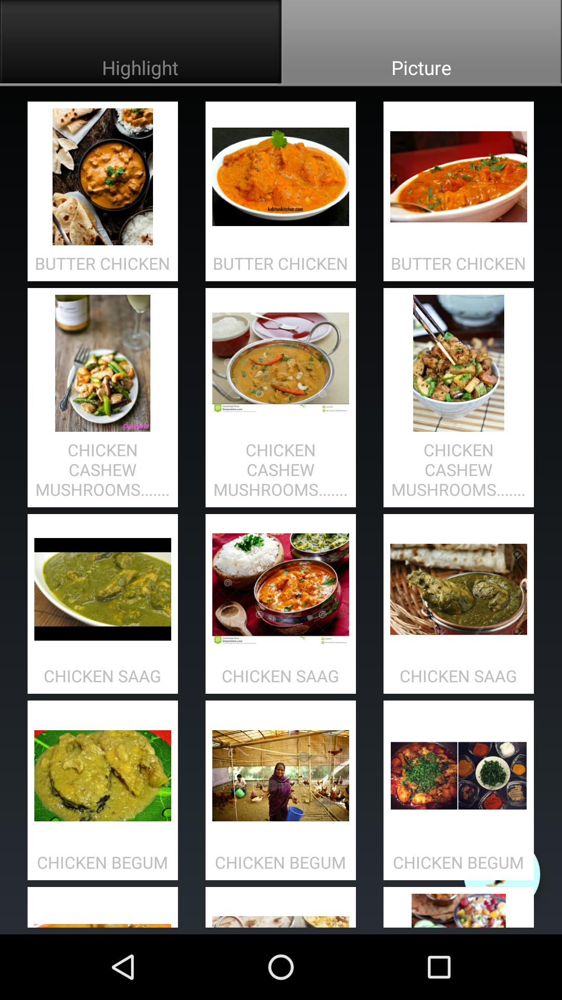
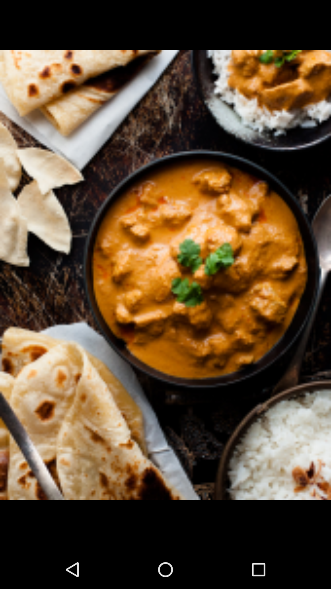

# Menu Picture
Have you ever went to a restaurant and find it hard to make an order because you don't know what `Bouillabaisse` is or what `鱼香肉丝` is made of. Image a menu full of unfamiliar items. This app is an attempt to make it less harsher for regular people like me to go to an exotic restaurant or one in different food culture.
You take a picture of the menu, swipe you finger to highlight the menu items, and the app will return a list of matched pictures of each menu items. (The ultimate goal is that you take a picture, and it gives you a list of best fit pictures with menu items attached, without any manual annotation. I am trying hard to make that happen speaking as of now.)

## Snapshots
From left to right,
1. Take a picture of the menu and highlight the menu items using your finger.
2. Picture tab gives you 3 pictures per menu item.
3. You can enlarge the picture. Click again, it will close and return to grid view.

## Contact
I would welcome any contribution. Contact me at wenjiesha.victor@gmail.com