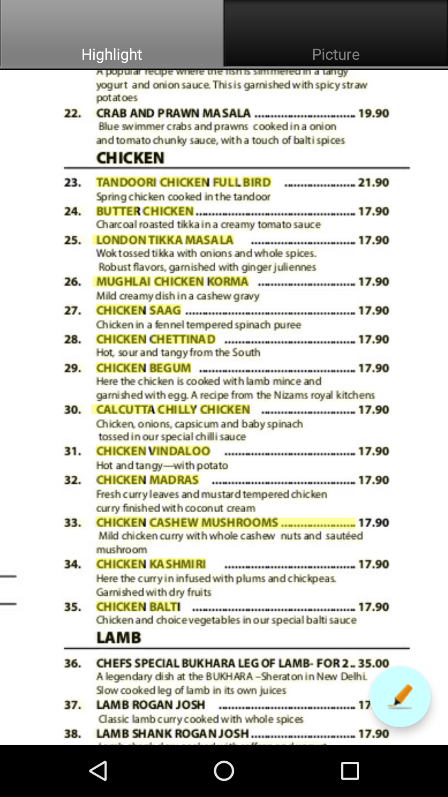

# menu_picture
Show pictures for menu item

# TODO(Python)
1. ~~clip rectangle.~~
2. ~~multiple connecting clip rectangle.~~ Currently use a single clipping rectangle to decide connectivity.
3. handle empty/error text annotations.
4. multiple response
5. language
6. ~~Show cropped picture.~~
7. ~~picture rotate.~~ Bounding box is always parallel to x, y axis.
8. ~~Annotate bounding box.~~ Basic rectangle annotation for the biggest bounding box.
9. Multiple sub bounding box annotation.
10. location info search
11. Image type.
12. ~~safety(no gross stuff)~~
13. ~~Search Image.~~
14. ~~Render Image.~~
15. ~~Combine Image.~~

# TODO(Android)
1. ~~Highlight~~
2. ~~Bounding Highlight.~~
3. ~~Canvas view with image background.~~
4. ~~align image to top.~~ aligh/scale with aspect ratio to the center
5. ~~highlight marker.~~
6. ~~add a imageview with modified pciture.~~ a view is good
7. ~~Highlight on top of picture.~~
8. ~~pan move picture.~~
9. ~~hidding button to control edit/move mode.~~
10. ~~vision api.~~
11. crop
12. ~~search~~
13. ~~hidding tab to show search result.~~
14. ~~bound view.~~
15. ~~move finger to enable bounds.~~
16. optimize some java code.
17. ~~Add a action bar to change mode, i.e. highlight, pan/move, image.~~
18. ~~image gallery.~~
19. ~~dynamic add images.~~
20. ~~return image results and add to images.~~
21. ~~image with text.~~
22. ~~clickable images.~~
23. ~~search images at the end of finger move.~~
24. ~~Fetch image from the search result and push to the grid view adapter.~~
25. Learn menu item.
26. ~~Update multiple menu items.~~
27. Use line break to distinguish menu items.
28. ~~If a rect is horizontal right to another one, then they are together. Otherwise, they are not.~~
29. Location as search context.
30. ~~Camera to take picture.~~
31. ~~zoom and pan around.~~
32. ~~floating button.~~
33. ~~floating button color.~~
34. ~~refactor highlight view to do most stuff in set function instead of constructor.~~
35. fix the error warning for package.
36. ~~switch highlight view with touch view.~~
37. ~~switch back/forth with icon change.~~
38. ~~sync bitmap when switching back and forth.~~
39. ~~sync highlight when switching back and forth.~~
40. ~~slight black ground color alignment.~~
41. refactor the code to be more readable.
42. remove fab on picture tab.
43. Unicode support
44. ~~fab to pop a list~~
45. fix initial size difference.
46. progress bar.
47. touch/highlight paint texture difference.
48. initial touch/highlight zoom difference.
49. Better text description. currently some words are missing.

# Bugs
1. ../data/roast_pork.png. Background black* color result in rgb(255,0,0) exception.

# Reference
1. [PIL](https://pillow.readthedocs.io/en/latest/handbook/index.html)
2. [PIL Annotation](http://effbot.org/imagingbook/imagedraw.htm)

# Notes
## Detect menu item
There is currently no good way to detect menu item. I am taking heuristic approach to say two boundin boxes should distance each other by no more than 2 characters and the slope is less than 0.1 (tanh). I am sure there are a million way a photo can break this constraints :(